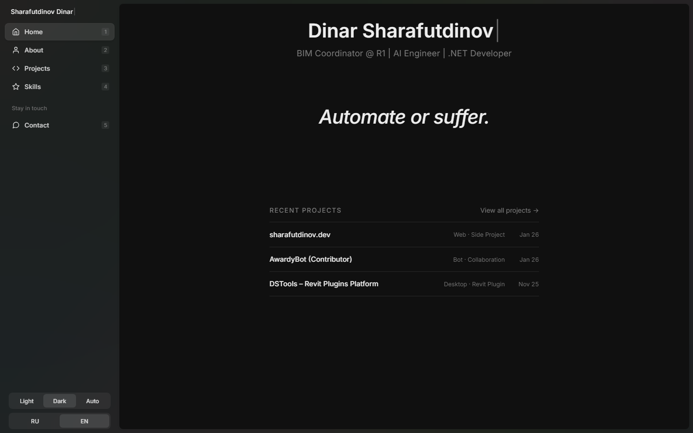
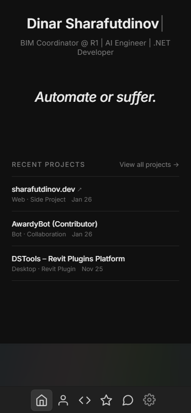
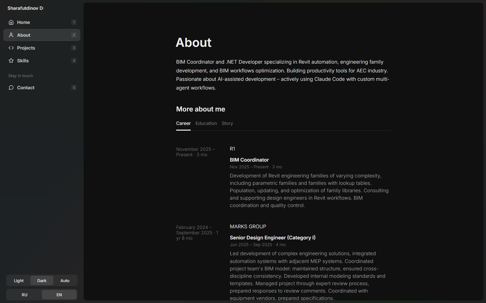
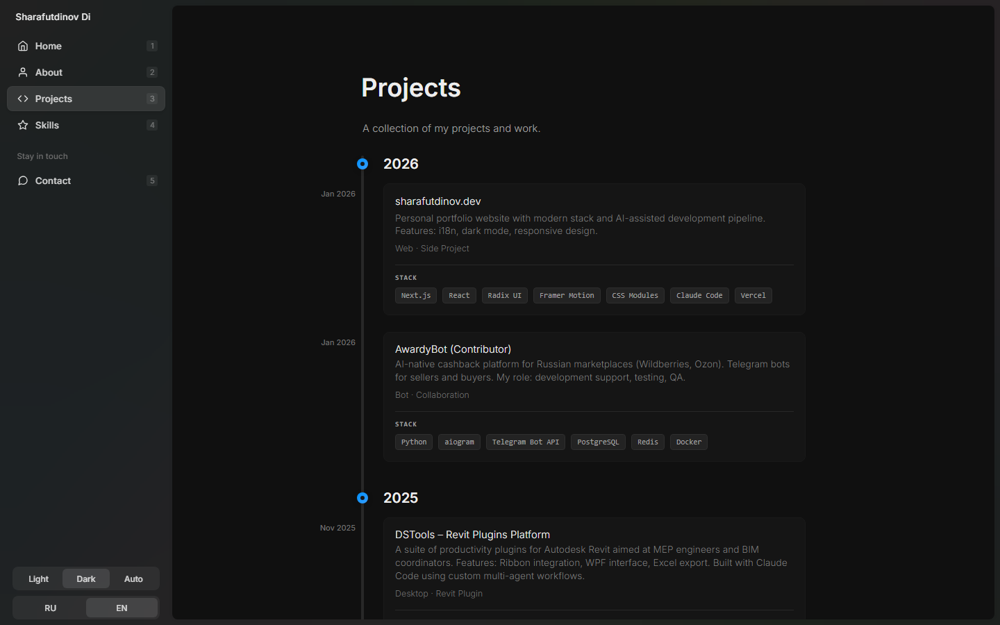
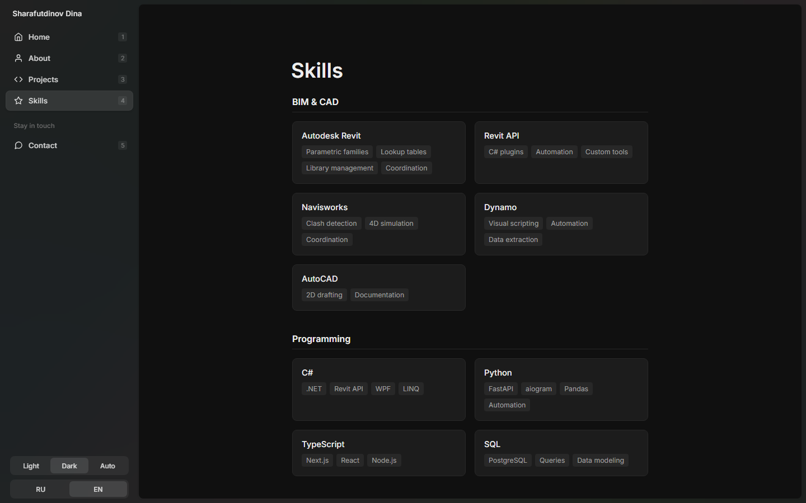
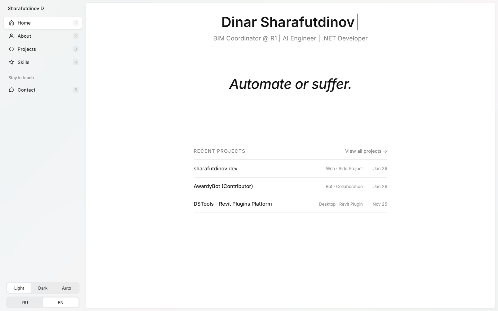
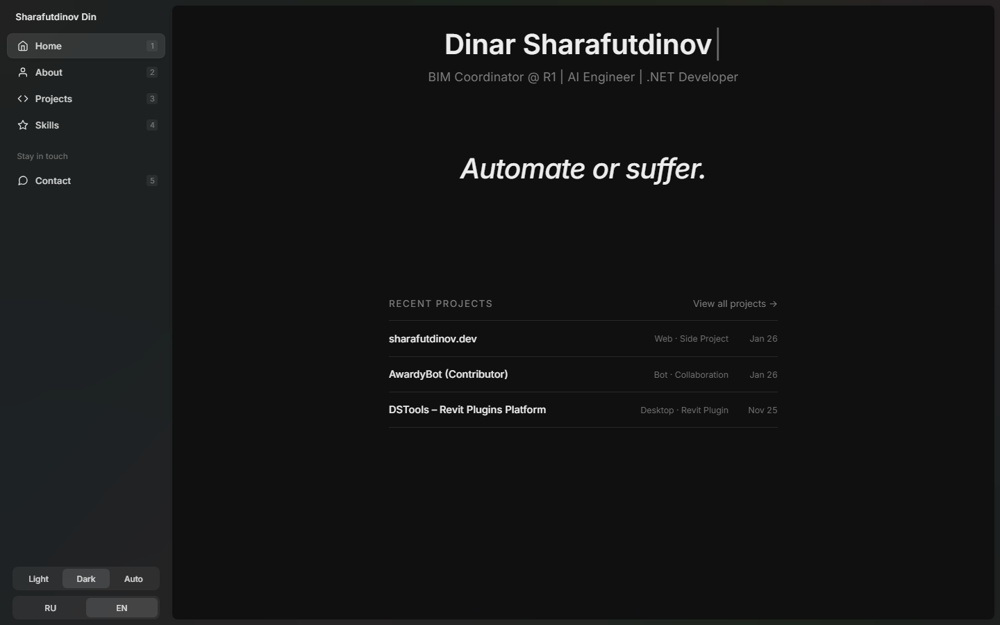

# sharafutdinov.dev

Personal portfolio website for **Dinar Sharafutdinov** — BIM Coordinator, .NET Developer, and AI enthusiast.

> Built with Next.js, React, and Framer Motion. Deployed on Vercel.

## Preview

| Desktop | Mobile |
|---------|--------|
|  |  |

<details>
<summary><strong>More Screenshots</strong></summary>

### About Page


### Projects Page


### Skills Page


### Dark/Light Mode
| Light | Dark |
|-------|------|
|  |  |

</details>

---

## Features

- **Bilingual** — Full Russian/English localization with language switcher
- **Dark/Light Mode** — System preference detection + manual toggle
- **Responsive** — Mobile-first design with adaptive layouts
- **Animated** — Smooth transitions powered by Framer Motion
- **Accessible** — Keyboard navigation, semantic HTML, ARIA labels
- **Fast** — Static generation, optimized images, minimal JS bundle

---

## Tech Stack

| Category | Technologies |
|----------|-------------|
| **Framework** | [Next.js](https://nextjs.org/) 12 |
| **UI** | [React](https://react.dev/) 18, [Radix UI](https://radix-ui.com/) |
| **Styling** | CSS Modules, [Radix Colors](https://radix-ui.com/colors) |
| **Animation** | [Framer Motion](https://framer.com/motion/) |
| **Deployment** | [Vercel](https://vercel.com/) |
| **Analytics** | [Vercel Analytics](https://vercel.com/analytics) |

---

## Project Structure

```
sharafutdinov.dev/
├── components/          # React components
│   ├── tiles/           # Card components (ExpTile, ProjectTile, etc.)
│   ├── menu.js          # Navigation
│   └── ...
├── content/
│   └── data/            # JSON data files (profile, projects, skills)
├── lib/                 # Utilities (i18n, analytics)
├── locales/             # Translation files (en.json, ru.json)
├── pages/               # Next.js pages
│   ├── index.js         # Home
│   ├── about.js         # About (Career, Education, Story tabs)
│   ├── projects.js      # Projects timeline
│   ├── skills.js        # Skills page
│   └── contact.js       # Contact page
├── public/              # Static assets
│   ├── certificates/    # PDF certificates
│   ├── icons/           # Social icons
│   └── feather/         # UI icons
└── styles/              # Global styles
```

---

## Getting Started

```bash
# Install dependencies
npm install

# Run development server
npm run dev

# Build for production
npm run build

# Run linting
npm run lint
```

Open [http://localhost:3000](http://localhost:3000) to see the site.

---

## Configuration

### Content

All content is stored in `content/data/` as JSON files:

- `profile.json` — Name, bio, social links
- `experience.json` — Work history
- `projects.json` — Portfolio projects
- `skills.json` — Technical skills
- `education.json` — Education & certificates
- `story.json` — Personal story & goals

### Localization

Translations are in `locales/`:
- `en.json` — English
- `ru.json` — Russian

---

## Deployment

### Vercel (Recommended)

[](https://vercel.com/new/clone?repository-url=https://github.com/sowecanya/sharafutdinov.dev)

### Manual

```bash
npm run build
npm run start
```

---

## Credits

Based on [sj.land](https://github.com/sjzhan9/sj-land) by Steven Zhang — thank you for the beautiful foundation!

---

## License

MIT License — feel free to use this as a template for your own portfolio.

---

<p align="center">
  <a href="https://sharafutdinov.dev">Live Site</a> •
  <a href="https://github.com/sowecanya">GitHub</a> •
  <a href="https://t.me/sowecanya">Telegram</a>
</p>
